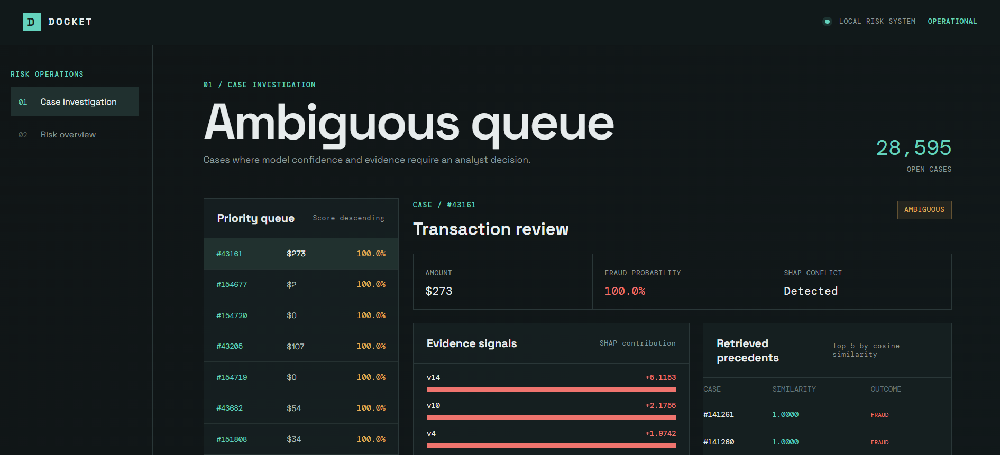

# Docket — AI-Grounded Risk Investigation Platform

**Razorpay AI Buildathon 2026 — AI Risk Manager Track**

Most fraud detection systems output a number. Docket investigates ambiguous 
cases and produces an auditable judgment — grounded in real precedent, 
honest about its own economics, and built to be defended, not just demoed.

## What it does

1. **Scores every transaction** using an XGBoost model trained on real, 
   imbalanced transaction data (ROC-AUC 0.973, average precision 0.877).
2. **Triages into three tiers** — auto-clear, auto-block, and ambiguous — 
   based on a defensible rule combining decision-boundary proximity and 
   genuine SHAP sign-conflict (not an arbitrary cutoff).
3. **Explains every score** with real SHAP values, not a black-box number.
4. **Retrieves real precedent** for ambiguous cases via a pgvector 
   similarity search against historical transactions and their confirmed 
   outcomes.
5. **Generates a grounded investigation memo** for each ambiguous case, 
   built deterministically from the transaction's real SHAP evidence and 
   precedent outcomes — every claim in the memo is traceable to real data, 
   nothing is invented.
6. **Quantifies its own economics** — a real cost-model comparison between 
   a naive threshold and the current tiering system, including an honest, 
   self-diagnosed finding: the current ambiguous-tier review volume costs 
   more than the fraud value it recovers, a genuine inefficiency the 
   system surfaced about itself.

## Why this, not just another fraud classifier

Anyone can output a fraud score. Docket is built around the harder, more 
realistic problem: producing a judgment a risk analyst could actually act 
on and defend — grounded in retrievable evidence, honest about its own 
blind spots, and quantified in terms a business actually cares about (cost, 
not just accuracy).

## Architecture

- **Backend**: FastAPI (Python)
- **Database**: PostgreSQL + pgvector (real similarity search for precedent 
  retrieval)
- **ML**: XGBoost (scoring) + SHAP (explainability)
- **Deployment**: Docker Compose — `db`, `api`, `frontend` services, runs 
  end-to-end with a single `docker compose up`
- **Dataset**: Kaggle Credit Card Fraud Detection (284,807 real, labeled 
  transactions)

## Running it

\`\`\`bash
git clone <repo-url>
cd docket
docker compose up -d --build
\`\`\`

Then load the dataset:
\`\`\`bash
docker compose exec api python load_data.py
\`\`\`

Train the model and score all transactions:
\`\`\`bash
docker compose exec api python train_model.py
\`\`\`

Dashboard available at \`http://localhost:<port>\`.

## Key results

| Metric | Value |
|---|---|
| ROC-AUC | 0.973 |
| Average Precision | 0.877 |
| Auto-cleared | 255,912 (89.9%) |
| Auto-blocked | 300 (0.1%) |
| Ambiguous (investigated) | 28,595 (10.0%) |

## What I'd build next

- Live concept-drift monitoring on the deployed model
- Tightened ambiguous-tier thresholds, informed by the cost-model finding
- Real device/IP fields (vs. this dataset's anonymized features) to make 
  fraud-ring detection meaningful rather than illustrative

## Honest notes on scope

- The investigation memo uses a deterministic, evidence-grounded generator 
  rather than a live LLM call — every claim in the memo is directly 
  traceable to the transaction's SHAP values and retrieved precedents.
- Fraud-ring detection uses synthetic device/IP identifiers layered on top 
  of real transaction data, since the source dataset has no relational 
  fields — clearly documented in code, never presented as detecting real 
  rings.